# Howto

- Go to [Releases](https://github.com/uta-org/road2ruin.github.io/releases) and download the latest version.

- Unzip the contents of this zip.

- Once downloaded, download [MultiMC](https://multimc.org/#Download).

- Open MultiMC and create an instance.

- Select "1.12.2" and name it.

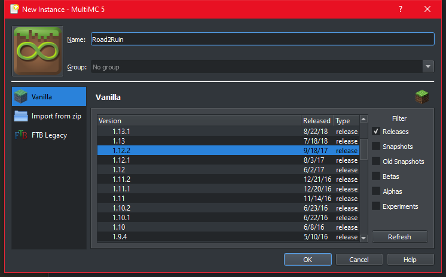

- Then, press "Change instance":

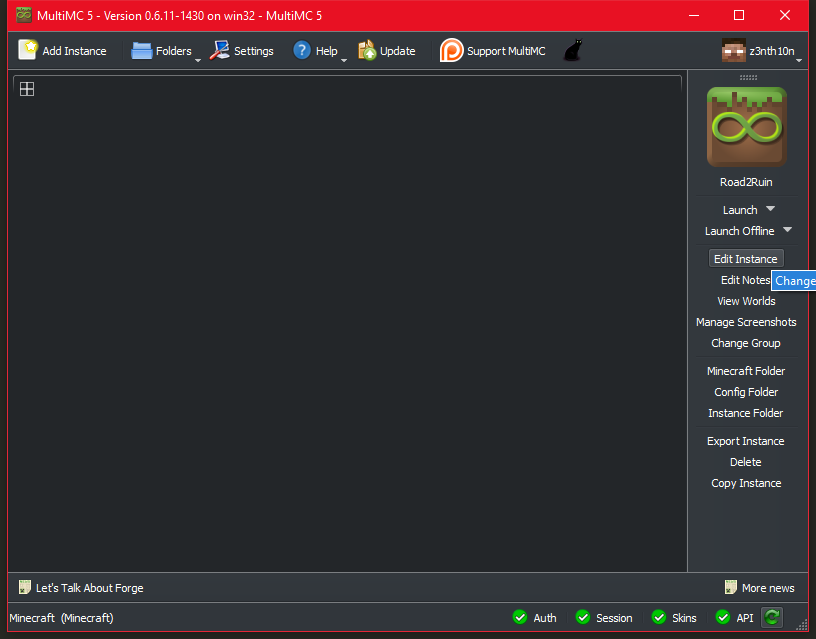

- Press "Install Forge":

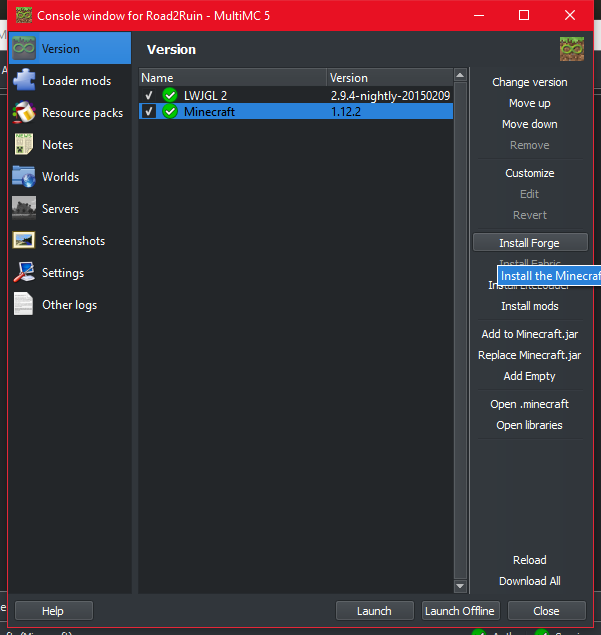

- Search the "14.23.5.2847" version.

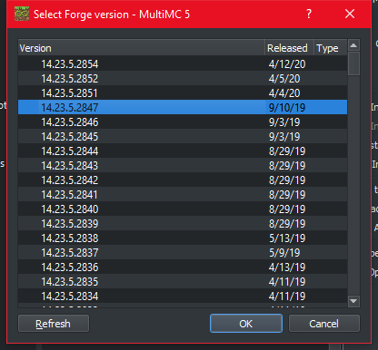

- Check that everything got installed correctly:

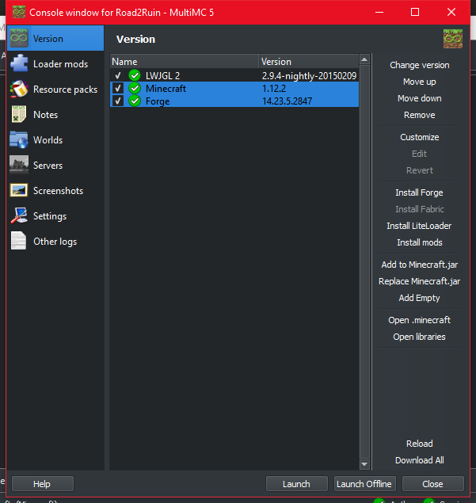

- Then, go to the "Loader mods" tab and press the "Add" button:

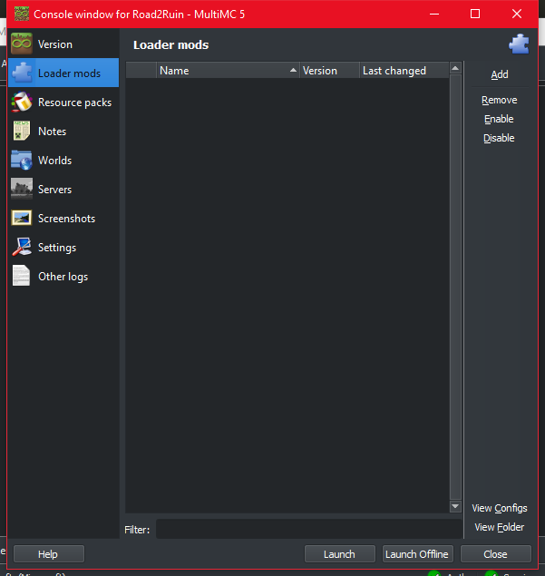

- Go to the unzipped folder (from the releases you downloaded before), and select all the jar files:

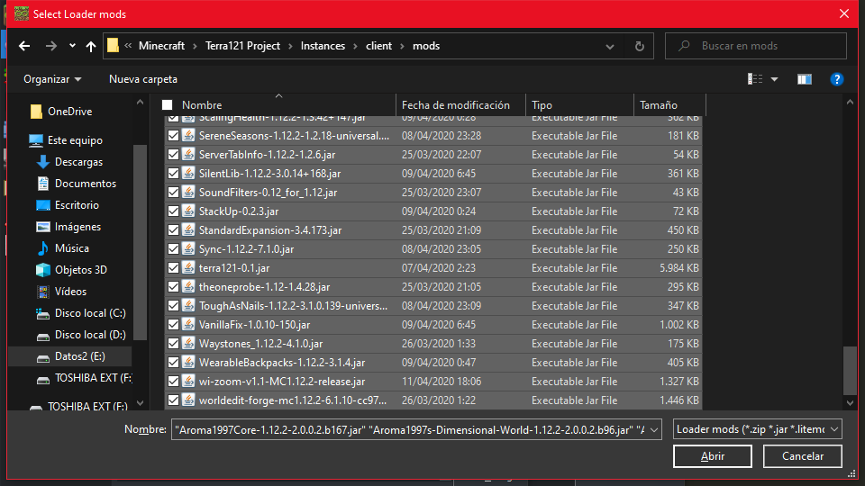

- Check that the mods has been added correctly:

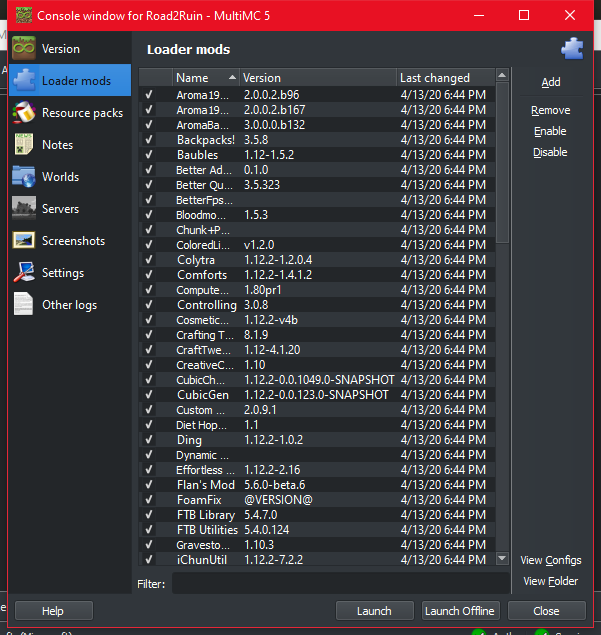

- Then, go to the "Settings" tab, and set the memory, we recommend at least 4GB of RAM:

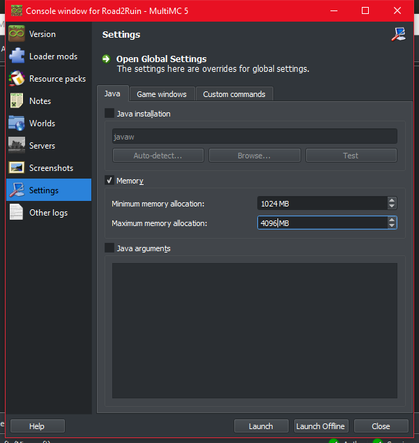

- Press the "Open .minecraft" button:

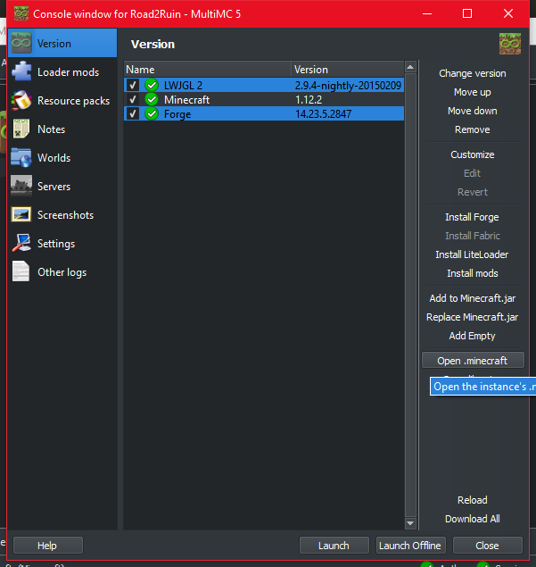

- And drop the "config" folder into the ".minecraft" folder:

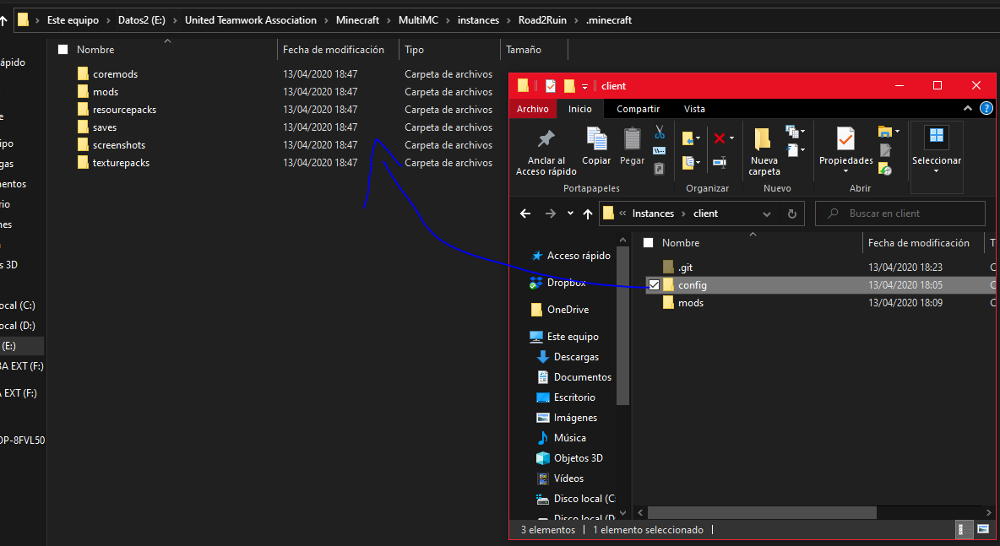

And that's all!